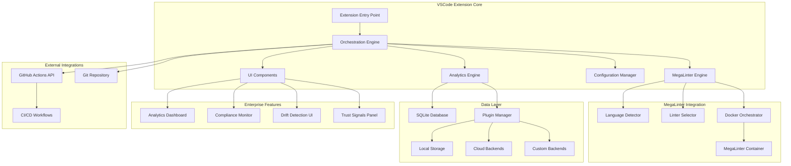

# MegaLinter Integration Architecture Specification

## Executive Summary

This document outlines the comprehensive architecture for enhancing the existing VSCode org-onboarding extension with advanced MegaLinter integration capabilities. The design preserves all existing enterprise governance features while adding sophisticated linter orchestration, analytics, and visualization capabilities.

## System Architecture Overview



## Core Components Architecture

### 1. MegaLinter Orchestration Engine

**Purpose**: Replace Trunk-focused approach with MegaLinter's 400+ linter ecosystem

**Key Components**:

- **Language Detection Service**: Analyzes repository files to identify languages/frameworks
- **Linter Selection Engine**: Intelligently selects appropriate linters based on detected context
- **Performance Optimizer**: Manages computational overhead and execution strategies
- **Configuration Validator**: Ensures proper MegaLinter configuration alignment

```typescript
interface MegaLinterOrchestrator {
  detectLanguages(repositoryPath: string): Promise<LanguageProfile>;
  selectLinters(
    profile: LanguageProfile,
    preferences: UserPreferences
  ): LinterConfiguration;
  executeLinting(config: LinterConfiguration): Promise<LintingResults>;
  optimizePerformance(config: LinterConfiguration): OptimizedConfiguration;
}

interface LanguageProfile {
  primary: string[];
  secondary: string[];
  frameworks: string[];
  buildTools: string[];
  configFiles: ConfigFileMap;
  complexity: "simple" | "moderate" | "complex";
}
```

### 2. Local-First Analytics Architecture

**Purpose**: Provide real-time insights with optional cloud synchronization

**Components**:

- **SQLite Database**: Primary local storage for metrics and historical data
- **Analytics Engine**: Real-time data processing and trend analysis
- **Plugin Storage Manager**: Extensible backend architecture
- **Data Synchronization Service**: Optional cloud sync for enterprise features

```typescript
interface AnalyticsEngine {
  processLintingResults(results: LintingResults): Promise<AnalyticsData>;
  generateInsights(timeRange: TimeRange): Promise<InsightCollection>;
  trackTrends(metrics: MetricType[]): Promise<TrendAnalysis>;
  exportData(
    format: ExportFormat,
    destination: StorageBackend
  ): Promise<ExportResult>;
}

interface StorageBackend {
  type: "sqlite" | "cloud" | "custom";
  configuration: BackendConfiguration;
  capabilities: StorageCapabilities;
}
```

### 3. Advanced Visualization Dashboard

**Purpose**: Provide comprehensive code quality insights and monitoring

**Components**:

- **Real-time Metrics Panel**: Live updating quality metrics
- **Trend Analysis Graphs**: Historical performance visualization
- **Violation Heat Maps**: Code quality hotspot identification
- **Remediation Guidance**: Intelligent fix suggestions

```typescript
interface DashboardManager {
  renderMetricsPanel(data: RealTimeMetrics): Promise<PanelComponent>;
  generateHeatMap(violations: ViolationData[]): Promise<HeatMapVisualization>;
  createTrendGraphs(history: HistoricalData): Promise<TrendVisualization>;
  showRemediationGuide(violations: ViolationData[]): Promise<RemediationPanel>;
}
```

## Data Architecture

### Database Schema Design

```sql
-- Core metrics storage
CREATE TABLE metrics (
    id INTEGER PRIMARY KEY,
    repository_id TEXT NOT NULL,
    timestamp DATETIME DEFAULT CURRENT_TIMESTAMP,
    linter_name TEXT NOT NULL,
    severity TEXT NOT NULL,
    violation_count INTEGER NOT NULL,
    files_scanned INTEGER NOT NULL,
    execution_time_ms INTEGER NOT NULL
);

-- Configuration history
CREATE TABLE configurations (
    id INTEGER PRIMARY KEY,
    repository_id TEXT NOT NULL,
    configuration_hash TEXT NOT NULL,
    active_linters TEXT NOT NULL, -- JSON array
    created_at DATETIME DEFAULT CURRENT_TIMESTAMP,
    performance_profile TEXT NOT NULL
);

-- Trend analysis cache
CREATE TABLE trend_cache (
    id INTEGER PRIMARY KEY,
    metric_type TEXT NOT NULL,
    time_window TEXT NOT NULL,
    data TEXT NOT NULL, -- JSON data
    updated_at DATETIME DEFAULT CURRENT_TIMESTAMP
);
```

### Configuration Data Models

```typescript
interface MegaLinterConfiguration {
  version: string;
  extends?: string[];
  linters: {
    enabled: LinterConfiguration[];
    disabled: string[];
    customRules: CustomRuleConfiguration[];
  };
  performance: {
    maxExecutionTime: number;
    parallelism: number;
    resourceLimits: ResourceLimits;
  };
  reporting: {
    formats: OutputFormat[];
    destinations: ReportDestination[];
    realTimeUpdates: boolean;
  };
}

interface LinterConfiguration {
  name: string;
  version?: string;
  enabled: boolean;
  severity: "error" | "warning" | "info";
  rules: Record<string, any>;
  filePatterns: string[];
  excludePatterns: string[];
}
```

## Integration Architecture

### GitHub Actions Enhancement

**Purpose**: Sophisticated CI/CD integration with MegaLinter workflows

```yaml
# Enhanced workflow template
name: MegaLinter Quality Gate
on: [push, pull_request]

jobs:
  megalinter:
    runs-on: ubuntu-latest
    steps:
      - uses: actions/checkout@v4
      - name: Run MegaLinter
        uses: oxsecurity/megalinter@v7
        env:
          MEGALINTER_CONFIG: .megalinter.yml
          REPORT_OUTPUT_FOLDER: megalinter-reports
          PLUGINS: |
            org-standards-plugin
          CUSTOM_RULES_PATH: .megalinter/rules
```

### Backward Compatibility Layer

**Purpose**: Maintain existing TrustSignals and DriftDetection interfaces

```typescript
// Legacy interface preservation
interface TrustSignalsCompatibilityLayer extends TrustSignals {
  // Enhanced fields
  megalinterStatus: "success" | "failure" | "pending" | "unknown";
  linterCoverage: number; // percentage of recommended linters active
  performanceScore: number; // execution efficiency metric

  // Legacy field mappings
  trunkConfigured: boolean; // maps to MegaLinter configuration status
}

interface DriftDetectionCompatibilityLayer extends DriftDetection {
  // Enhanced drift types
  linterDrift: string[]; // replaces lintingDrift with more granular info
  configurationDrift: string[]; // enhanced config drift detection
  performanceDrift: string[]; // new: performance regression detection
}
```

## Plugin Architecture Design

### Storage Backend Plugins

```typescript
abstract class StorageBackendPlugin {
  abstract initialize(config: BackendConfiguration): Promise<void>;
  abstract store(data: AnalyticsData): Promise<void>;
  abstract retrieve(query: DataQuery): Promise<AnalyticsData[]>;
  abstract export(format: ExportFormat): Promise<ExportResult>;

  // Plugin metadata
  abstract get name(): string;
  abstract get version(): string;
  abstract get capabilities(): StorageCapabilities;
}

// Built-in plugins
class SQLiteStoragePlugin extends StorageBackendPlugin {
  /* ... */
}
class CloudStoragePlugin extends StorageBackendPlugin {
  /* ... */
}
class ElasticsearchPlugin extends StorageBackendPlugin {
  /* ... */
}
```

### Analytics Backend Plugins

```typescript
abstract class AnalyticsBackendPlugin {
  abstract processMetrics(metrics: RawMetrics): Promise<ProcessedMetrics>;
  abstract generateInsights(data: ProcessedMetrics): Promise<InsightCollection>;
  abstract createVisualizations(
    insights: InsightCollection
  ): Promise<VisualizationData>;
}
```

## Implementation Phases

### Phase 1: Core MegaLinter Integration (Weeks 1-4)

- Replace Trunk orchestration with MegaLinter engine
- Implement basic language detection and linter selection
- Create compatibility layer for existing interfaces
- Basic SQLite storage implementation

### Phase 2: Dynamic Profiling & Configuration (Weeks 5-8)

- Intelligent repository profiling system
- Dynamic configuration generation
- Performance optimization engine
- Enhanced GitHub Actions integration

### Phase 3: Advanced Analytics & Dashboards (Weeks 9-12)

- Real-time analytics processing
- Advanced visualization components
- Trend analysis and insights generation
- Plugin architecture implementation

### Phase 4: Enterprise Features & Optimization (Weeks 13-16)

- Cloud synchronization capabilities
- Advanced enterprise integrations
- Performance tuning and scalability
- Comprehensive testing and documentation

## Security Considerations

### Docker Security

- Secure container execution environment
- Resource limits and sandboxing
- Privilege escalation prevention
- Secret management for enterprise integrations

### Data Privacy

- Local-first data processing
- Encrypted storage for sensitive information
- GDPR compliance for enterprise features
- Audit logging for compliance requirements

### API Security

- Secure GitHub API token management
- Rate limiting and error handling
- Input validation and sanitization
- Cross-site scripting prevention

## Performance Optimization Strategies

### Linter Execution Optimization

```typescript
interface PerformanceStrategy {
  parallelExecution: boolean;
  incrementalScanning: boolean;
  cacheStrategy: "aggressive" | "conservative" | "disabled";
  resourceLimits: {
    maxMemory: string;
    maxCpuTime: number;
    maxFileSize: number;
  };
}
```

### Caching Architecture

- File-level change detection for incremental scanning
- Linter result caching with smart invalidation
- Configuration caching for faster startup
- Analytics data caching for improved dashboard performance

## Success Metrics & KPIs

### Technical Metrics

- Linter execution time (target: <2 minutes for typical repository)
- Memory usage (target: <1GB peak usage)
- Dashboard load time (target: <3 seconds)
- Plugin installation success rate (target: >95%)

### User Experience Metrics

- Time to first meaningful insight (target: <30 seconds)
- Configuration drift detection accuracy (target: >90%)
- False positive rate (target: <5%)
- User satisfaction score (target: >4.5/5)

### Enterprise Metrics

- Multi-repository compliance rate
- Security vulnerability detection rate
- Developer productivity improvement
- Maintenance overhead reduction

## Conclusion

This architecture provides a robust foundation for transforming the VSCode org-onboarding extension into a comprehensive code quality and governance platform. The design emphasizes:

1. **Scalability**: Plugin architecture supports future extensibility
2. **Performance**: Intelligent optimization strategies for 400+ linters
3. **Compatibility**: Seamless migration from existing Trunk-based approach
4. **Enterprise-Ready**: Advanced analytics and governance capabilities
5. **Local-First**: Privacy-focused with optional cloud synchronization

The phased implementation approach ensures manageable development cycles while delivering value incrementally to users.
